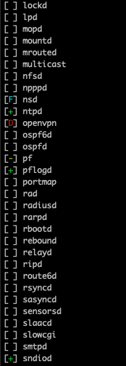

# rcctl-stat
Provides a slightly more visually appealing way to check which services are running and/or enabled in OpenBSD.

- `[ ] service` means the service is not enabled and not running
- `[-] service` means the service is enabled but not running
- `[+] service` means the service is enabled and running
- `[D] service` means the service is enabled but has failed (degraded/down)
- `[F] service` means the service is not enabled and running (forced)

